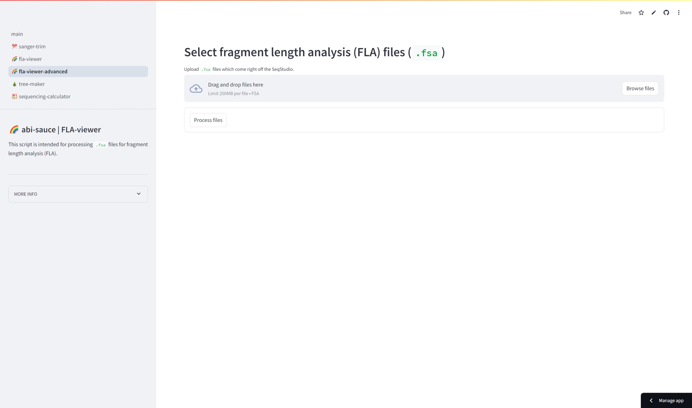
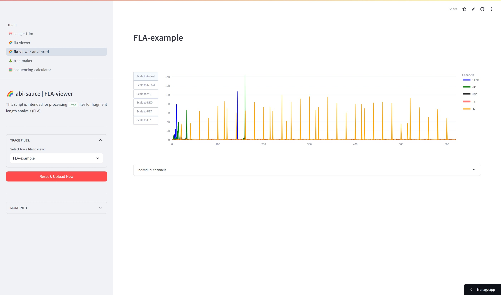

# X.1: Fragment Length Analysis

## Objective

To use fragment length analysis for performing parentage analysis or identify an unknown individual.

## Required and recommended software

None! You should be able to complete this with just web-based resources. I've created a tool for visualizing and processing fragment length analysis data ([fla-viewer-advanced](https://ericksamera-abi-sauce-main-349h0c.streamlit.app/fla-viewer-advanced)). Below is just a preview, I'd recommend clicking the link to open it in a new tab.


A preview of the tool.


## Background

**Short tandem repeats (STR)/simple sequence repeats (SSR)/microsatellites** are small repetitive segments of DNA that appear in specific parts of the genome.

```
// Example
AT AT AT (a 2-base repeat repeated 3 times)
GATA GATA GATA GATA (a 4-base repeat repeated 4 times)
```

SSRs are highly variable between individuals in terms of the number of repeats, making them a valuable tool for distinguishing one person’s DNA from another. This variability is what makes SSRs so useful in genetic analysis, particularly for DNA fingerprinting and parentage analysis. Individuals that are related to each other would have a similar number of repeats at a given locus.

The idea is that the loci are standardized and have been selected for high variability among individuals and stable inheritance from parents.

```
// Example
AGG AGG AGG AGG (individual 1)

AGG AGG AGG AGG (parent 1)
AGG AGG AGG AGG AGG (parent 2)
AGG AGG AGG (parent 3)

The individual is probably related to parent 1.
```

**Fragment Length Analysis (FLA)** is a powerful molecular biology technique used to identify, compare, and analyze DNA fragments based on their sizes.&#x20;

Primers designed for SSR loci are labeled with fluorescent dyes (e.g., FAM, VIC, NED, PET). These primers amplify the SSR regions via PCR, producing fragments that reflect the number of repeats at each locus. Some fancy gels would be used to compare the fragment sizes, but this was not so accurate in the olden days. On a regular gel, it's tough to see a difference of two bases in the case of a dinucleotide repeat. The more modern technology uses capillary electrophoresis with fluorescent detectors to measure fragment lengths.&#x20;

<details>

<summary>Benchtop Methods</summary>

1. SSR region is amplified by PCR using a fluorescently labeled primer pair and high-fidelity polymerase.
2. PCR products could be run on agarose gel to verify product formation.
3. PCR products are diluted significantly (1:10 -- 1:100, PCR product:dH2O)
4. Load PCR products into optical tube strips with the following volumes: 1 µL diluted PCR product; 0.15 µL 600 LIZ size standard; 8.85 µL HiDi Formamide
5. Cover plates with septa and spin down.
6. Load into SeqStudio.

</details>

## Analysis


Example FLA output file.




### Navigate to the online tool.



([Here's the link to the site.](https://ericksamera-abi-sauce-main-349h0c.streamlit.app/fla-viewer-advanced))



### Upload the FSA file(s).

You can either drag the file in or click on the button to browse files. A small bar should appear to show the file upload process. The bar will disappear when the file has been uploaded.



### Click on the \`Process files\` button.

Once the files are uploaded, click on the button to process the files and a new screen should appear that will display the electropherogram with its many dye channels.





### Hover over a peak to identify the fragment size.

When you hover over a coloured peak, it will provide information on which dye is detected, the calculated size of the fragment, and the peak's fluorescence level. [These are the amplified products--i.e., the individuals alleles for a given SSR locus.](#user-content-fn-1)[^1]





### Record down the alleles.

Erick will add some feature so that you can click and the tooltip will stay, but for now, just hover over it and record alleles. Alternatively, you can navigate down to the `Individual channels` section and click on the checkbox to `show table with individual channels`. This will show a table with all the predicted peaks for each of the respective channels.


In the side bar, you can start from scratch and upload new files by clicking the red button which says `Reset & Upload New`.



### &#x20;Questions

* Maybe scroll around and appreciate what the peaks represent. Sometimes there will be a really large peak which appears in multiple channels. What might this mean?
* What are the alleles for VIC and 6-FAM in the file?
* **VIC** is the fluorophore used to detect a ACG-repeat. **6-FAM** is the fluorophore used to detect a AT-repeat. \
  Imagine that the VIC marker in the file has a repeat length of 6. What would the amplicon length be if it had a repeat length of 7? \
  \
  The 6-FAM marker in the file has a repeat length of 8. What would the amplicon length be if it had a repeat length of 7?
* Imagine that the example file represents the DNA that has been found at a crime scene. There are multiple suspects in custody. \
  `Suspect 1: (6-FAM=146; VIC=165)`\
  `Suspect 2: (6-FAM=132; VIC=153)`\
  `Suspect 3: (6-FAM=142; VIC=162)`\
  `Suspect 4: (6-FAM=142; VIC=159)`\
  `Suspect 5: (6-FAM=138; VIC=165)`\
  \
  Use the FLA analysis to identify the perpetrator. Who is the most related to the perpetrator?

<details>

<summary>Further Questions</summary>

1. How does the variation happen in SSR? What causes a difference in repeat lengths?
2. What does it mean if a person’s STR profile at a locus has two peaks?
3. Why are multiple STR loci used in forensic DNA profiling?
4. Why might different populations have distinct STR allele frequencies, and how is this useful?

</details>

[^1]: Note: you can't have 0.3681 of a basepair. These are calculated values.
