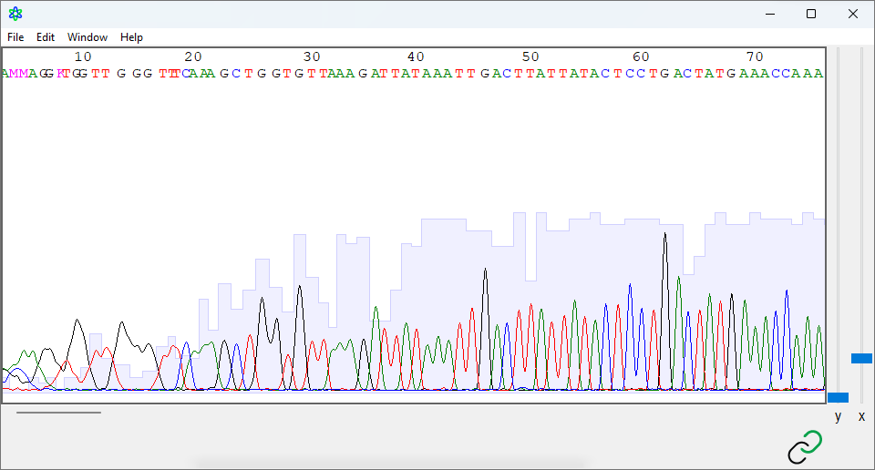

# 1.1 :: Introduction to Bioinformatics


**Learning Objectives**

#### **1.** Knowledge:

* [ ] Recall the definitions of bioinformatics and computational biology and differentiate between them.

#### 2. Comphrension:

* [ ] Explain the role of bioinformatics in the context of data processing in biology, particularly at the Applied Genomics Centre (AGC)​.

#### 3. Application:

* [ ] Utilize knowledge of different file formats (`AB1`, `FASTQ`, `FASTA`) to identify the correct file type for a given DNA sequence data scenario​.

#### 4. Analysis

* [ ] Break down the differences between bioinformatics and computational biology and identify the overlap in their roles at the AGC​.

#### 5. Synthesis

* [ ] &#x20;Develop a personal definition of bioinformatics based on provided examples and its main goals​.

#### 6. Evaluation

* [ ] &#x20;Assess the advantages and disadvantages of different data file formats (`AB1`, `FASTQ`, `FASTA`) and determine the most appropriate format to use in a given situation.


## Background

As techniques in molecular biology (especially DNA sequencing) have developed exponentially in recent years, the dataset that must be processed afterwards has also ballooned in size. Just as someone needs to perform the benchwork to produce this data, someone needs to process it. For even our projects in the lab, this opens a niche role in research: the bioinformatician.\
\
Although our lab does not necessarily specialize our researchers into divisions of wet lab and dry lab, it's important to note that bioinformatics is its own skillset that deserves its own time and attention. This book is designed to introduce anyone with little-to-no programming experience to bioinformatics, the software, and its applications as they relate to our work at the Applied Genomics Centre (AGC).

## What is bioinformatics?

There are many ways to define it. Here are a few examples:

> **Bioinformatics** is a sub-discipline of biology and computer science concerned with the acquisition, storage, analysis, and dissemination of biological data, most often of DNA and amino acid sequences.
>
> (shamelessly stolen from Dr. Adams' BIOL 3320 lecture)

> **Bioinformatics** is a data science that investigates how information is stored within and processed by living organisms.\
> (also stolen from the BioStar Handbook)

The work of the "bioinformatics" division at the AGC is very broad, and it's very clear that nobody covers every single skill in this book. We are not programmers; we are biologists first (who happen to have some experience with computers).


How would you define bioinformatics and what are its main goals?


## _in vivo_, _in vitro,_ and now _in silico_

Before bioinformatics, there were two ways to get the answer to your biological question:

* [_in vivo_](#user-content-fn-1)[^1], within a living organism.
* [_in vitro_](#user-content-fn-2)[^2]_,_ within an artificial environment, most-commonly imagined to use Petri dishes.

The advent of bioinformatics has provided an opportunity to use something else entirely. Before even touching a micropipette or mouse, there is now a way to make predictions and perform biological experiments [using the silicon chip of a microprocessor](#user-content-fn-3)[^3]. Like I said, however, this isn't to say that there is no "lab work" involved. Data processing is a feat in itself.

## The computational biologist

Data processing in biology follows this paradigm: \
**Produce data -> Model or transform data -> Interpret Data**

With that in mind, you may have heard of computational biology as another name for a biologist that works with computers. This leads us to our big question:


What's the difference between a bioinformatician and a computational biologist?


<table data-full-width="false"><thead><tr><th>Computational biology</th><th>Bioinformatics</th></tr></thead><tbody><tr><td>Developing and applying <em>mathematical models</em> and <em>computational simulations</em> for the study of biological phenomena</td><td>Organizing and processing data to generate a biological inference</td></tr><tr><td><strong>Example:</strong> A <em>computational biologist</em> creates a simulation of the electrical interactions of a cation channel to simulate channel conductance</td><td><strong>Example:</strong> A <em>bioinformatician</em> takes whole-genome sequencing (WGS) data to characterize groups of variants in the genome which relate to certain diseases.</td></tr></tbody></table>

Something to note is that there is a lot of overlap between those two, especially in the kind of work we do at the AGC.

## DNA sequence data

The main type of data processed at the AGC is **DNA sequencing data** (either from _Sanger sequencing_ or _NGS methods_).\
\
Single target Sanger sequencing is easier to view and analyze (and we'll start here). \
\
Massively parallel sequencing from NGS gives you massive amounts of data. Viewing and processing this kind of data requires more processing power. \
\
Just for some scale, Sanger sequencing can give us 96 different DNA sequences from a single run. NGS gives us **20 million** and herein lies the importance of being able to process all that.\
\
Something we will briefly introduce at this point is appreciating that **different file formats have different purposes**. Here are a few of the most common that we work with in the lab:



<figure><figcaption>
<strong>Figure 1.</strong> ApE visualization of an electropherogram showing basecalls, fluorescence peaks, and quality score bars.
</figcaption></figure>

**AB1 trace files** (`.ab1`, `.abif`, `.abif`,  etc.)\
These are the files right off the sequencer. This file contains [relative fluorescence peaks](#user-content-fn-4)[^4], per-base quality scores, and the basecalls.

**How to open these files:**\
These files are surprisingly difficult to open and require specific software. Although there is a set of proprietary[^5] software for handling electropherograms, our lab recommends using AplasmidEditor (APE).



<figure><figcaption>
<strong>Figure 2.</strong> Screenshot of FASTQ-formatted file showing sequence and PHRED quality scores per base.
</figcaption></figure>

**FASTQ files** (`.fastq`, `.fq`, etc.)\
These files are text-based formats for representing a nucleotide sequence and quality scores per base.

**How to open these files:**\
Minimally, any text editor will do!



<figure><figcaption>
<strong>Figure 3.</strong> Screenshot of FASTQ-formatted file showing sequence.
</figcaption></figure>

**FASTA files** (`.fasta`, `.fas`, `.fa`, etc.[^6])\
These are text-based formats for representing a nucleotide sequence ⁠— and specifically just the sequence.

**How to open these files:**\
Minimally, any text editor will do!



We will go into more detail about the makeup of each of those files, but for now, just appreciate that all 3 of those files are representations of the same sample.


What's the difference between the 3 in terms of what data is stored? Can you think of think of situations where it might be preferable to use one over the other?


## Summary

Bioinformatics sub-discipline of biology concerned with transforming data to make biological inferences. This is subtly different from computational biology, although there is a lot of overlap in the role at the lab.\
\
Bioinformatics came out of necessity to process large amounts of sequencing data. There are 3 main sequencing types that we work with in the lab: electropherogram data (`.ab1`), FASTA data (`.fasta`), and FASTQ data (`.fastq`).

[^1]: in living.

[^2]: in glass.

[^3]: _in silico,_ or in silicon.

[^4]: This is more formally called an electropherogram (or sometimes a chromatogram).

[^5]: read: _expensive_

[^6]: Shhhh.. A little spoiler for you: the file extension for a FASTA file is absolutely arbitrary. The file extension is just a hint to the computer about what to do with it. We'll discuss the FASTA format in more detail in later sections.
