# 1.2.1 :: Retrieving sequences from NCBI


**Learning Objectives**

* [ ] Explore NCBI's Nucleotide database.
  * [ ] Use the search function for NCBI's nucleotide database.
  * [ ] Download FASTA and GenBank sequence data.
  * [ ] Construct an Advanced Search query to find more specific sequences.
* [ ] Explore the Assembly database.
* [ ] Explore the RefSeq database.
* [ ] Explore the Sequence Read Archive (SRA) and BioProjects.
* [ ] Explore NCBI Datasets.


## Background

One of the most common tasks in our "bioinformatics" division is retrieving biological sequences of interest — whether it be genomic DNA sequences, mRNA transcripts, amino acids, or others.\
\
The largest repository of publicly available biological sequences is NCBI GenBank which is maintained by the National Center for Biotechnology Information (NCBI), a division of the National Institutes of Health (NIH) in the United States. The database contains over **300 million** records including whole genomes, genes, transcripts, proteins, and more which are completely freely accessible to anyone with an internet connection.\
\
GenBank is split up into several databases, which can be accessed through the _Nucleotide_ database ([https://www.ncbi.nlm.nih.gov/nuccore](https://www.ncbi.nlm.nih.gov/nuccore)). NCBI also runs several other databases of interest, including Assembly (assembled genomes and other genomic sequencing data) and RefSeq (a curated collection of genomic DNA, transcript, and protein sequences with stable IDs).

<figure>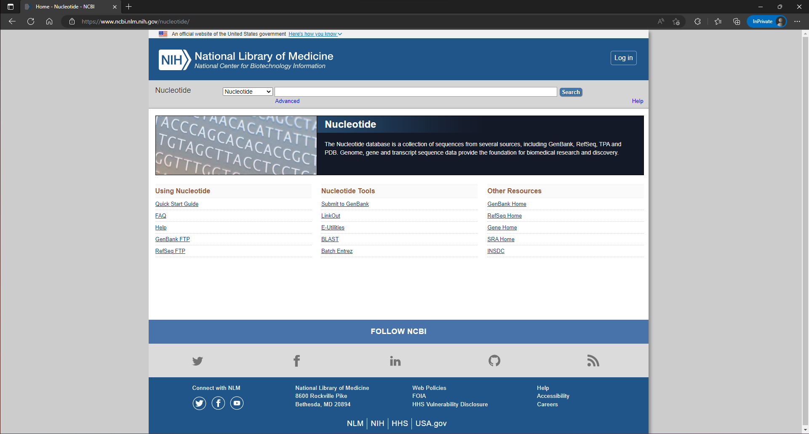<figcaption>
<strong>Figure 1.</strong> The NCBI main page (<a href="https://www.ncbi.nlm.nih.gov/">https://www.ncbi.nlm.nih.gov/</a>) showcasing some general resources.
</figcaption></figure>

## Searching the Nucleotide database


The Nucleotide database can be easily accessed with the following link: [https://www.ncbi.nlm.nih.gov/nuccore](https://www.ncbi.nlm.nih.gov/nuccore)


<figure>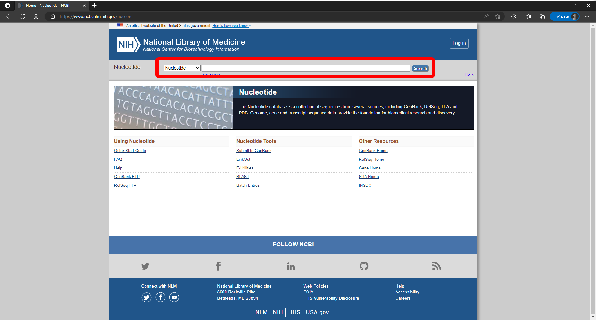<figcaption>
<strong>Figure 2.</strong> The NCBI Nucleotide database landing page with a red box highlighting the Search bar with the Nucleotide database selected.
</figcaption></figure>

After navigating to the site (which should be as simple as clicking on the link), it's time to make a search.\
\
Make a quick search with any kind of nucleotide sequence you are interested in. Some suggestions:

* Salmonella enterica subsp. enterica serovar Dublin
* Homo sapiens CACNA1A
* Parageobacillus thermoglucosidasius 16S rRNA

After performing your search, take a glance at the example search below (Figure 3) and notice some main features.

## Anatomy of the results

<figure>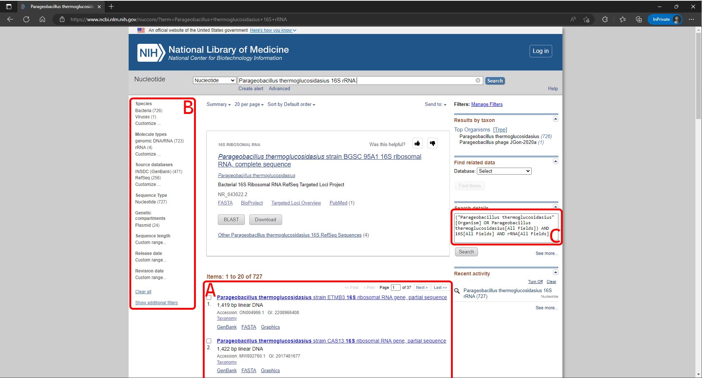<figcaption>
<strong>Figure 3.</strong> An example results page for a search with the Nucleotide database on NCBI.
</figcaption></figure>



Click through the tabs to find out more about each section.


As you click through the tabs, make sure to actually click through the options in your NCBI search page! The best way to learn this stuff is to do it yourself.




Shown in this box are the results. Each one represents an entry in the nucleotide database that somehow matches your search query. Take a look at the first one and we can deconstruct what information is displayed here.

* [**Title**](#user-content-fn-1)[^1]**:** Parageobacillus thermoglucosidasius strain ETMB3 16S ribosomal RNA gene, partial sequence\
  This somewhat self-explanatory: it provides a description of the entry in terms of the source organism, the strain, the region that was sequenced, and the completeness of the entry.
* **Sequence length:** 1,419 bp linear DNA\
  This shows how long the sequence is. This is sometimes useful for filtering sequences to a specific level of completeness since some submissions may not actually have the sequencing completeness in their title or description.
* **Accession:** ON004969.1\
  This is a unique identifier for the entry and includes a version number. When referring to specific entries, the accession is preferred instead of the sequence description and acts much like a DOI when referring to specific journal articles. When a sequence is updated, the version number is increased, but the accession stays the same.
* **GI number:** 2208966408\
  Similar to the accession in that it is a unique identifier. The GI number is the original numbering system that was implemented in 1999. When a sequence is updated, it recieves an entirely new GI number.
* **Taxonomy**\
  This gives a link to NCBI taxonomy, another useful resource which gives you more information regarding the [classification and nomenclature of the organism](#user-content-fn-2)[^2].
* **GenBank**\
  View the accession in GenBank format. We'll discuss this format in a later section, just know that in addition to the nucleotide sequence, it also holds annotation information.
* **FASTA**\
  View the accession in FASTA format.
* **Graphics**\
  View a graphical representation of the sequence.



Shown in this box are some examples of filters that can be applied to your search results. You can filter your results to a specific kingdom, molecule type, sequence length, and release date (just to name a few).&#x20;



This box shows a breakdown of how the database interpreted your search query. We'll go into more detail about how this works in a later section.



There are many more features that haven't been explicitly highlighted in a box. Some of these include:

* Number of items to display per page
* Sorting method for displaying results
* Options to export results
* Recent search history
* Finding related items in another database
* Filtering results by taxon

I'd recommend you play around with these.



## The accession page

There a 3 main ways to view an accession on NCBI (pictured below): GenBank format, FASTA format, and [graphical format](#user-content-fn-3)[^3].



<figure>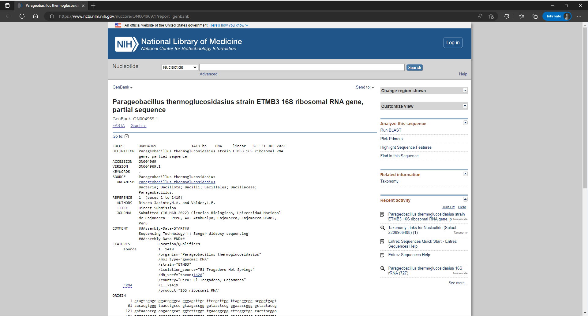<figcaption>
<strong>Figure 4.</strong> An accession page showing the result in GenBank format.
</figcaption></figure>



<figure>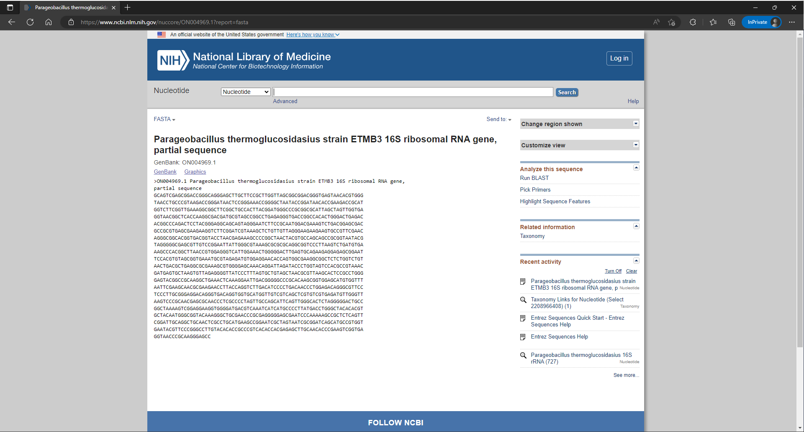<figcaption>
<strong>Figure 5.</strong> An accession page showing the result in FASTA format.
</figcaption></figure>



<figure>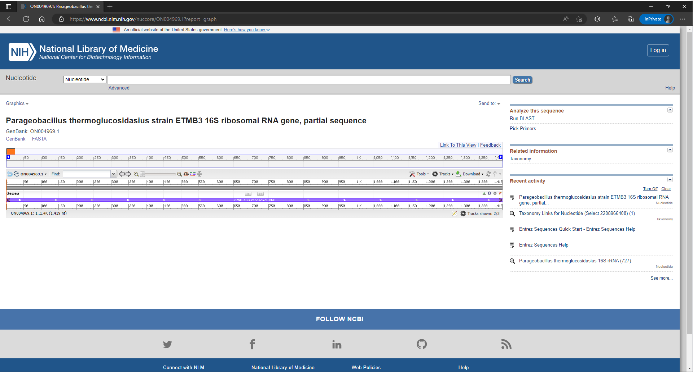<figcaption>
<strong>Figure 6.</strong> An accession page showing the result in graphical format.
</figcaption></figure>




What are some similarities and differences between the views? What kind of information is displayed in each view? Are there any situations you can think of where one might be preferred over the other?


Now that we have a sequence that we want to look at, the next thing to do is download it so that we can process it further.

In the top right corner, just under the search bar, there is a dropdown titled, "Send to:".

1. Click on the `Send to:` dropdown.
2. Click on `File`.
3. If you are in GenBank view, select `GenBank` for the `Format`. If you are in FASTA view, select `FASTA` as the format.
4. Click `Create File`.

Ta-da! You've downloaded a sequence from the NCBI Nucleotide database. For some extra practice:

1. Repeat the steps above for the other format. (If you downloaded in GenBank format, do the same now in FASTA format, and vice-versa)&#x20;


Try to open the files that you just downloaded. Start to get familiar with opening them in `notepad` or some other simple text editor.


## The Advanced Search Builder

As you try out more searches on NCBI's nucleotide database, you may notice that it will sometimes retrieve a sequence that wasn't exactly what you were looking for. For me, this happened often when I wanted to pull 16S sequences and some of the results were whole genome assemblies that happened to contain that gene.

Just like in performing a literature search, the Advanced Search builder is your best friend for constructing complex search queries to find specific information within the NCBI databases.

To access the advanced search builder, go to the NCBI website and click the "`Advanced`" link from the search bar. This will take you to a page where you can enter your search terms and construct your query.

<figure>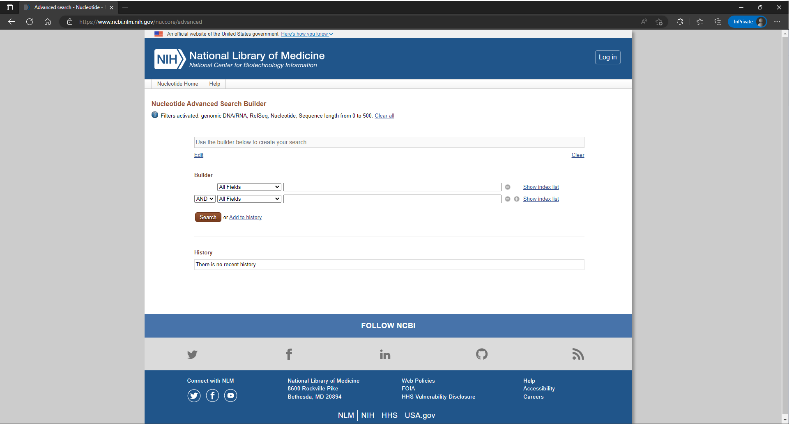<figcaption>
<strong>Figure 7.</strong> The Nucleotide Advanced Search Builder landing page.
</figcaption></figure>

As seen briefly in the previous section, the search query is generated by linking search terms with Boolean operators (AND, OR, NOT). You can set the relationship between search terms with a handy little dropdown to select AND, OR, NOT. You can also specify which fields to search for per search term. As seen above (Figure 7), it is currently set to search `All Fields` for both terms.\
\
Another useful feature is the `Show index list` button which you can use to look at search terms that exist in the database. This will show a list of search terms that match the one you entered and preview the number of sequences that include that term.


Try to set up a search to retrieve 18S sequences from _Caenorhabditis elegans_ using the Advanced Search Builder.

Make sure to the set the fields to limit your search terms!


As you start construct your search query, also notice how text in the the grey box changes. This displays the actual search query that is passed to the Nucleotide database (which we saw in [the previous section](1.2.1-retrieving-sequences-from-ncbi.md#c-search-details)).

The key to the Advanced Search Builder is that you have to tell it exactly what you want with as little ambiguity as possible. You'll find that this is a common way of thinking in especially bioinformatics.

> For an example, the following is a full search entry that I used to retrieve sequences of bacterial 16S for some large-scale alignments.
>
> <pre data-title="Full 16S Sequences" data-overflow="wrap"><code><strong>(<a data-footnote-ref href="#user-content-fn-4">16s[All Fields]</a> AND <a data-footnote-ref href="#user-content-fn-5">rRNA[All Fields]</a> AND <a data-footnote-ref href="#user-content-fn-6">"partial sequence"[All Fields]</a> <a data-footnote-ref href="#user-content-fn-7">NOT "operon"[All Fields]</a>) AND <a data-footnote-ref href="#user-content-fn-8">"Bacteria"[Primary Organism]</a> AND <a data-footnote-ref href="#user-content-fn-9">1:5000[Sequence Length]</a>
> </strong></code></pre>

### Constructing optimal search queries

Unfortunately, due to the massive size of the Nucleotide database (and a quirk of allowing researchers to submit their own sequences), there are major inconsistencies with how people annotate and submit their sequences. As you may notice, your search query needs to be carefully generated to retrieve the results you actually want. Here are some tips for generating some better search queries.

* **The `Title` search description is your best friend.**\
  Some sequences submitted to the Nucleotide database will have the bare minimum of annotation associated with. As a result, some search terms may cause you to miss a large portion of the sequences you want. \
  \
  One of the prime examples of this issue is using the `Gene` search description. Most sequences that are submitted to the Nucleotide database do not include this field and only describe it in the title. By limiting your searches to look for a specific gene in the `Gene` field, you're actually inadvertently filtering out sequences of your desired gene!\
  \
  One of the most powerful filtering methods is to search within the title of the sequence. Generally, most researchers will include all of the important information about the sequence in at least the title.




Try generating this specific search query:

* Search for the "CACNA1A" gene&#x20;
* Also specifically search for the "neuronal" version
* Search within the `organism` of _Homo sapiens_
* Limit your results to the author, "Wappl"

Instead of a list of results, this should redirect you to a specific entry.




* Try using the tips from above to construct optimal search queries
* There is a dropdown to specify which field to search for each search term.
* Try using combinations of AND, OR, and NOT as necessary.



Answer

If you've arrived at a page titled, **"Homo sapiens neuronal calcium channel alpha 1a subunit Cav 2.1 (CACNA1A) mRNA, complete cds"** with the accession, **FJ040507.1,** congratulations! You've created a search query that finds exactly what we wanted.

## Assembly


The Assembly database can be easily accessed with the following link: [https://www.ncbi.nlm.nih.gov/assembly](https://www.ncbi.nlm.nih.gov/assembly)


We previously looked at entries of single sequences or portions of genes. If we want to zoom out and search at the genome level, we can use the NCBI Assembly database. This database contains a collection of assembled genomes and associated data, including annotations, sequencing reads, and metadata, from a wide range of organisms.\
\
To use the Assembly database, go to the NCBI website and select the "Assembly" option from the main navigation menu. From here, you can search for assemblies by organism name, assembly accession number, or other relevant keywords (just like we did in the Nucleotide database). You can also browse the database by taxonomy, which allows you to explore the available genomes of different organisms.\
\
Most of the time, we are searching for all genome assemblies available for a specific species or taxonomic group.

<figure>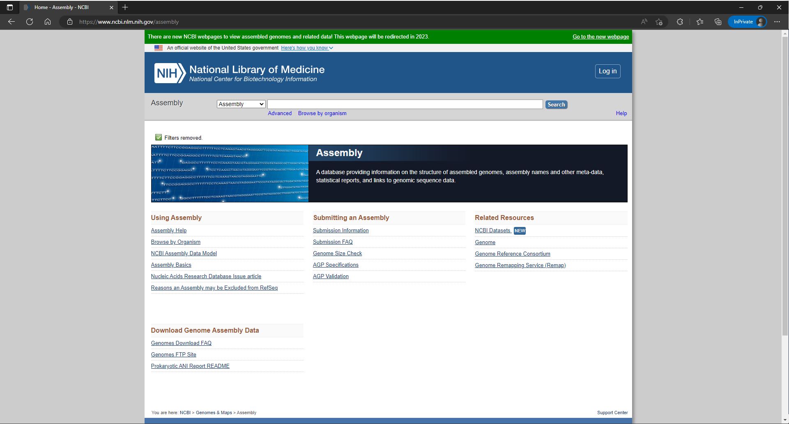<figcaption>
<strong>Figure 8.</strong> The NCBI Assembly database landing page.
</figcaption></figure>

<figure>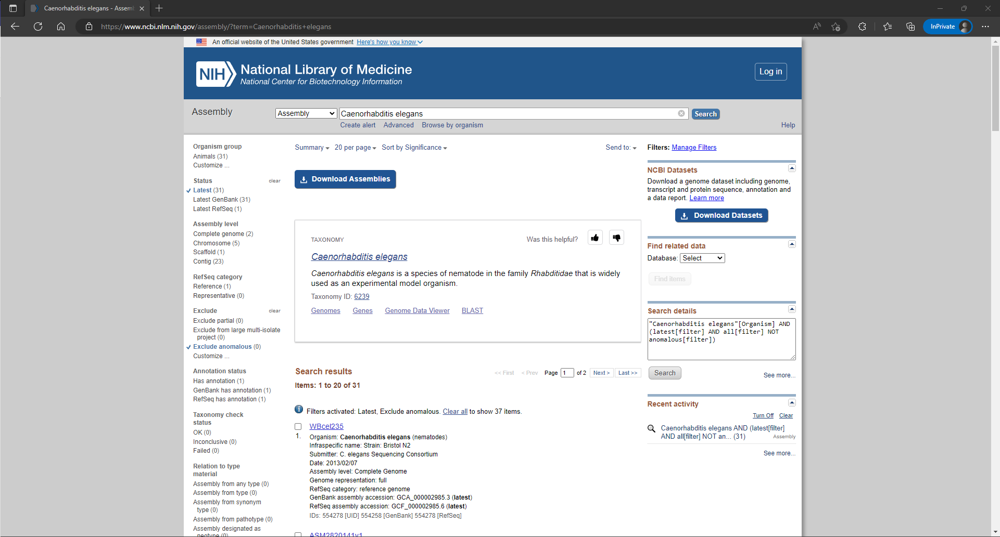<figcaption>
<strong>Figure 9.</strong> Example search results for <em>C. elegans</em> in the Assembly database.
</figcaption></figure>

To download assemblies, select the assemblies you would like to download with the checkboxes, or select nothing if you'd like to select every assembly on the page. Click on the large `Download Assemblies` button to open up a drop-down menu for specifying the source database and the file type that you want to download the assemblies as.\
\
To get more information about each assembly, click on the title of the assembly.

<figure>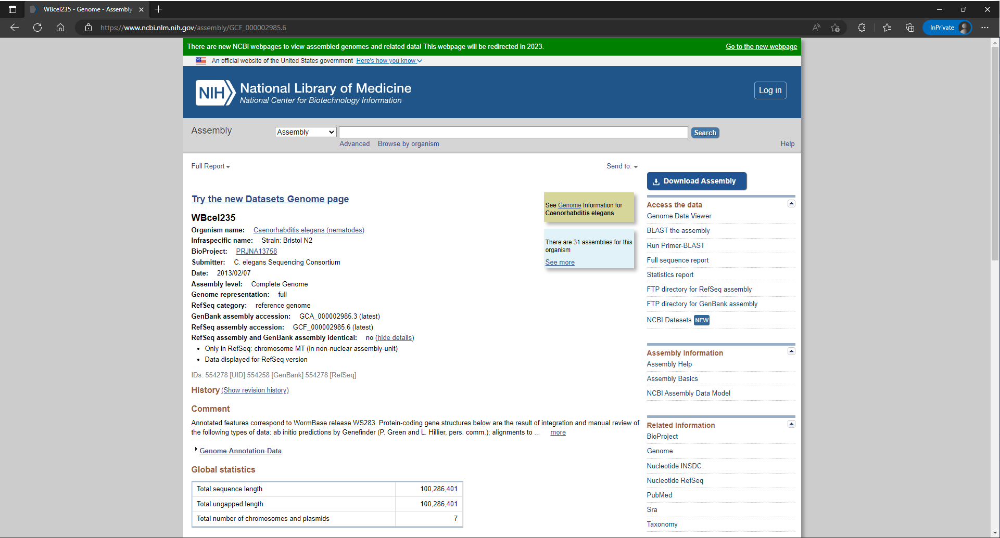<figcaption>
<strong>Figure 10.</strong> Information page for a <em>C. elegans</em> genomic assembly.
</figcaption></figure>


What kind of information do you find on this page? Where can I find the date of submission? What about the assembly level of the genome?


Just as a spoiler for the future, there are som additional functions that are available on this page:

* Genome Data Viewer - View the genome in the NCBI Genome Data Viewer.
* BLAST the assembly - run a BLAST search using only this assembly as the database (we'll go into how to run BLAST searches soon!
* Run Primer-BLAST - design primers in primer-BLAST using only this assembly as the database for specifity checking.

## RefSeq

The RefSeq database is a subset of the Nucleotide database that provides high-quality, annotated, and non-redundant collection of genomes from a wide range of organisms, including bacteria, fungi, plants, and animals. When we refer to a reference genome, you'll find it here.


The RefSeq database can be easily accessed with the following link: [https://www.ncbi.nlm.nih.gov/refseq/](https://www.ncbi.nlm.nih.gov/refseq/)


In the Nucleotide database, you can add `srcdb_refseq[PROP] AND refseq[FILTER]` to your search query to limit your results to just the RefSeq database. Essentially, all searches for RefSeq sequences go through the Nucleotide database anyway. The RefSeq landing page is just a convenient way of applying the filters.


Take a look at some RefSeq entries for _Homo sapiens_! Try to find the most up-to-date reference genome for humans.


## The Sequence Read Archive (SRA)

The Sequence Read Archive (SRA) is a public repository of raw sequencing data generated from a wide range of genomic studies, including transcriptomics, epigenomics, and metagenomics. Investigators that produce high-throughput sequencing data will often submit to the SRA, and many journals actually require submission to the SRA as part of the peer review process.

The SRA contains a vast collection of sequencing data generated from high-throughput sequencing technologies, such as Illumina, PacBio, and Oxford Nanopore. This data includes raw sequence reads, alignments, and quality scores, which can be used to perform a variety of analyses, such as de novo assembly, variant calling, and gene expression analysis. For our purposes, the SRA is especially useful for validating sequencing pipelines by providing a source of test data.

Searching through SRA entries works much like the Nucleotide database.&#x20;

<figure>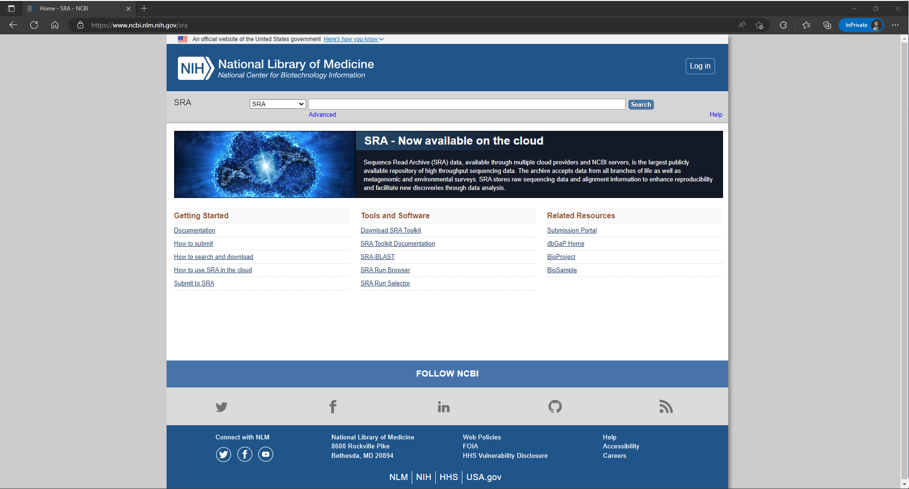<figcaption>
<strong>Figure 11.</strong> The landing page for the Sequence Read Archive (SRA).
</figcaption></figure>

### BioProject

Sequencing reads in SRA often belong to a larger organization of data in BioProject. Each BioProject record contains more information about the experimental conditions, metadata, and sampling information that was used to generate those sequencing reads. This is especially useful for finding related sequencing reads from SRA that belong to the same project.


The files you'll find in SRA and BioProject are much larger. We won't be downloading anything for now. Just appreciate that these databases exist.


## NCBI datasets

NCBI datasets is a new tool for accessing NCBI databases, specifically to retrieve genomes and gene data. You may have noticed that green banner in the Assembly database which advertises it. This is intended to be more user-friendly while also providing programmatic access of the NCBI databases through APIs.

<figure>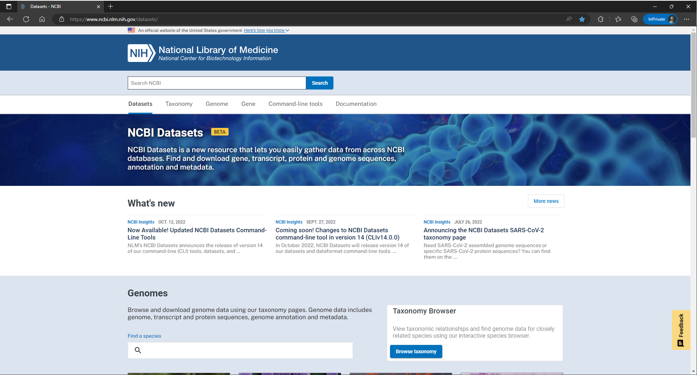<figcaption>
<strong>Figure 12.</strong> The landing page for NCBI datasets.
</figcaption></figure>

 

<figure><figcaption>
<strong>Figure 12.</strong> An example search result for <em>Caenorhabditis elegans</em> in NCBI datasets showing the variety of entries across different databases of NCBI.
</figcaption></figure>

 

<figure><figcaption>
<strong>Figure 13.</strong> The genome data page for <em>C. elegans</em> showing the available genome assemblies with options for filtering.
</figcaption></figure>


Try to access the genomes available for _Bos taurus._ Play around with the filtering options.


## Summary

There are a variety of databases available on NCBI with different kinds of entries and different purposes. To get the most out of these databases, search queries must be fine-tuned to get the results you really want.

Further Reading

Entrez:\
[https://www.ncbi.nlm.nih.gov/books/NBK3837/](https://www.ncbi.nlm.nih.gov/books/NBK3837/)

Search Field Descriptions for Sequence Databases:\
[https://www.ncbi.nlm.nih.gov/books/NBK49540/](https://www.ncbi.nlm.nih.gov/books/NBK49540/)

Links to the landing pages listed in this section:\
[https://www.ncbi.nlm.nih.gov/nuccore/](https://www.ncbi.nlm.nih.gov/nuccore/)\
[https://www.ncbi.nlm.nih.gov/assembly/](https://www.ncbi.nlm.nih.gov/assembly/)\
[https://www.ncbi.nlm.nih.gov/refseq/](https://www.ncbi.nlm.nih.gov/refseq/)\
[https://www.ncbi.nlm.nih.gov/sra](https://www.ncbi.nlm.nih.gov/sra)\
[https://www.ncbi.nlm.nih.gov/datasets/](https://www.ncbi.nlm.nih.gov/datasets/)

[^1]: Technically, this is actually the definition or description of entry.

[^2]: Technically, NCBI taxonomy is not an authoritative source for nomenclature or classification -- they recommend you still consult relevant scientific literature.

[^3]: More realistically, there are 2 ways. We don't really use graphical format as much. There are better ways to do this.

[^4]: Search `All Fields` to make sure they contain "16S" somewhere in there.

[^5]: Search `All Fields` to make sure they contain "rRNA" somewhere in there.

[^6]: Searching `All Fields`, make sure that "partial sequence" appears somewhere. Funnily enough, this filters out entries that come from genome assemblies.

[^7]: Searching `All Fields`, make sure that "operon" does not appear anywhere. Annoyingly, without this portion of the search, it will also retrieve results that contain entire rRNA operons. I was interested in just 16S.

[^8]: Make sure that for each result, the `Primary Organism` is "Bacteria".

[^9]: For each entry, ensure that the `Sequence Length` is between 1 and 5000 bp.
