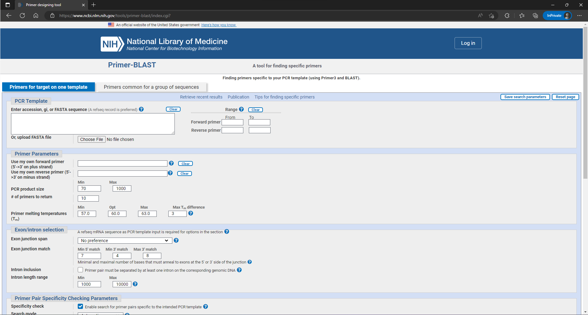

# 2.3: Primer-BLAST


**Learning Objectives**

* [ ] Review the basics of PCR and considerations for primer design such as primer length, melting temperature, and GC content.
* [ ] Use Primer-BLAST to design primers that target a gene of interest.
* [ ] Use the specificity-checking&#x20;
* [ ] Consider some troubleshooting scenarios that can arise from primer design such as low efficiency or non-specific amplification.


## Background

Primers are a critical component of the work we do in molecular biology. We use them in PCR, qPCR, and any kind of sequencing. They are short sequences of DNA that act as the starting points for DNA amplification. Back in the 1970s, [Kleppe and colleagues](#user-content-fn-1)[^1] discovered that DNA polymerase requires a short DNA or RNA sequence to initiation DNA replication.

Since then, researchers have been able to exploit this biological machinery to selectively amplify regions of interest with the development of PCR. It has since become a foundational lab technique with applications in genetic analysis, diagnostic testing, gene cloning, and more.

## General considerations

When designing primers, there are several key considerations that must be taken into account.

#### Primer length—Primers are generally `18` to `25` nucleotides long.

For an extreme example, take the `7` nucleotide sequence `5'-GATTACA-3'`. Looking just at the number of possible matches, that sequence occurs almost 100,000 times in the horse genome (and that's not even considering acceptable mismatches).  For a primer set, you want to find the sweet spot of specificity and length.

#### GC content—40% to 60% is usually ideal.

Primer composition is why you can't just make a `40` nucleotide primer to be as specific as possible. There are a few competing factors such as the GC content and [melting temperature (Tm)](#user-content-fn-2)[^2]. For stability purposes, G-C pairing is more stable than A-T pairing due to an additional H-bond.

#### Melting temperature (Tm)—Our lab usually aims for approximately 60°C.

The melting temperature is the temperature at which the DNA strands comprising the primer dissociate (or melt) from their complementary DNA strands. As you can imagine, this plays a large role into the specificity and efficiency of PCR amplification.

There are a lot of ways to calculate Tm:

> $$T_m = 2(A + T) + 4(G+C)$$\
> The Wallace Rule

> $$T_m = 64.9 + 41 (G+C-16.4)/(A+T+G+C)$$\
> The modified Wallace rule

> $$T_m = ...$$\
> There's also the SantaLucia (1998) and Breslauer (1986) method which incorporate thermodynamic parameter like enthalpy and entropy.

#### 3' end stability—should be pretty stable!

If you recall, DNA is synthesized in 5' to 3'. The efficiency of DNA synthesis is immensely hindered if the 3' end of your primer is prone to secondary structures or any kind of instability. If the 3' end isn't stable enough, [the train doesn't leave the station](#user-content-fn-3)[^3]!

#### Secondary structures and primer-dimers—ideally none!

Another thing is self-complementarity. Single-stranded DNA with the opportunity for some self-complimentary base-pairing will form secondary structures like hairpins. It's also possible for primer-dimers to form where the primers don't bind to your DNA sequence of interest, but instead to other copies of itself. And this is, as you can imagine, not very efficient for amplifying our region of interest.

And on top of the constraints for one primer, you also have to consider the other primer as well.

#### Melting temperature difference—ideally none (but within 3°C is usually acceptable).

Ideally, the melting temperature of the primers should be similar so that when the DNA dissociates into single-strands, both of your primers will bind at approximately the same temperature. Usually this number is approximately 3°C.

#### Great primers cannot overpower bad targets.

If your primers are intended to bind to highly repetitive regions, you are going to have a bad time. If your primers are binding to a gene region with many duplications across the genome, you are likely not going to amplify only the one you want.

Primer design can be quite difficult to manually perform from scratch. As with the theme of the rest of this bioinformatics book, it is useful to understand how the calculations were applied, [but it may be more practical to use an existing too](#user-content-fn-4)[^4]l.

## NCBI's Primer-BLAST


NCBI's Primer-BLAST tool can be accessed with this link: [https://www.ncbi.nlm.nih.gov/tools/primer-blast/](https://www.ncbi.nlm.nih.gov/tools/primer-blast/)


Primer-BLAST is one online tool developed by NCBI with 2 important components—"primer" and BLAST—which integrates primer design and BLAST into one convenient application.

<figure><figcaption>
<strong>Figure 1.</strong> The main search page for performing NCBI Primer-BLAST. 
</figcaption></figure>

### General usage

1. **Input your sequence.**\
   To use Primer-BLAST, input a DNA sequence to use as the template for designing primers. This sequence can be pasted into the text box (or an accession number can be used instead to grab a sequence from NCBI's database).&#x20;
2. **Edit ranges if needed.**\
   Because you'll want to use this to amplify specific regions of your template, it is sometimes useful to actually specify where you want the program to look when designing your primers. You can specify a range of your template to look for forward and reverse primers, respectively, with the box to the right labeled `Range`.
3. **Adjust primer parameters.**\
   NCBI has more options here to give you some more control over the primer design parameters. There may be a scenario where you already have a forward primer that you like and you may just want to re-design a reverse primer (or vice versa). \
   \
   You may also have specific constraints on how large your amplicon is—for example, Sanger sequencing usually aims for below 600 bp. For general PCR, we generally don't design primers above 1500 bp so the default parameters are usually sufficient here.\
   \
   As for the primer melting temperatures (Tm), NCBI's parameters usually fall within our general use-case at the lab. 57–64°C with a maximum difference of 3°C is usually what we use.

For this choose-your-own-adventure book, check the next section if you'd like to include some specificity checking—otherwise, hit the large `Get Primers` button and [**watch the magic happen!**](2.3-primer-blast.md#results)

### Specificity checking

One of the big features of NCBI's Primer-BLAST is the ability to check the specificity of the designed primers. In addition to checking the specificity for your primers with your target organism, it's also good to check your primers against other organisms too. [There are some scenarios where you are amplifying DNA from a specific species and not all the DNA in your sample belongs to the same species](#user-content-fn-5)[^5].

1. **Choose your database.**\
   You can choose between several databases to check your primers against. There's the human, genome, the mouse genome, the `nr` (non-redundant) database, among others.
2. **Choose your organism(s).**\
   You can limit your specificity checking to particular organisms with this parameter, especially if you are designing your primers to be used with a particular species.
3. **Adjust primer pair stringency**\
   These options adjust how stricly Primer-BLAST enforces specificity. As the stringency gets stricter, fewer potential off-target sequences will be considered.

And now we can submit!

## Results

asdfasdf

## Summary

[^1]: Kleppe, K., Ohtsuka, E., Kleppe, R., Molineux, I., & Khorana, H. G. (1971). Studies on Polynucleotides. _Journal of Molecular Biology_, _56_(2), 341–361. [https://doi.org/10.1016/0022-2836(71)90469-4](https://doi.org/10.1016/0022-2836\(71\)90469-4)

[^2]: Important to note, this is not the _annealing temperature_ (Ta) (although they are related).

[^3]: DNA polymerase can't start synthesizing!

[^4]: No need to reinvent the wheel here!

[^5]: Can you maybe think of some reasons why this may be the case?
