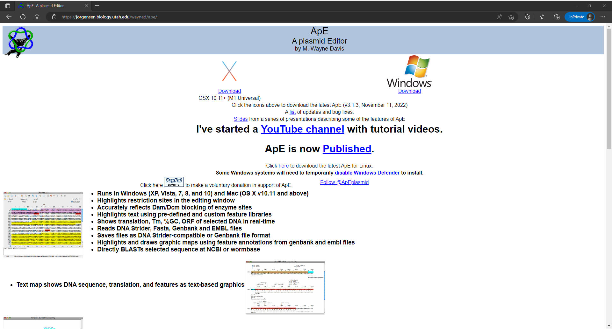
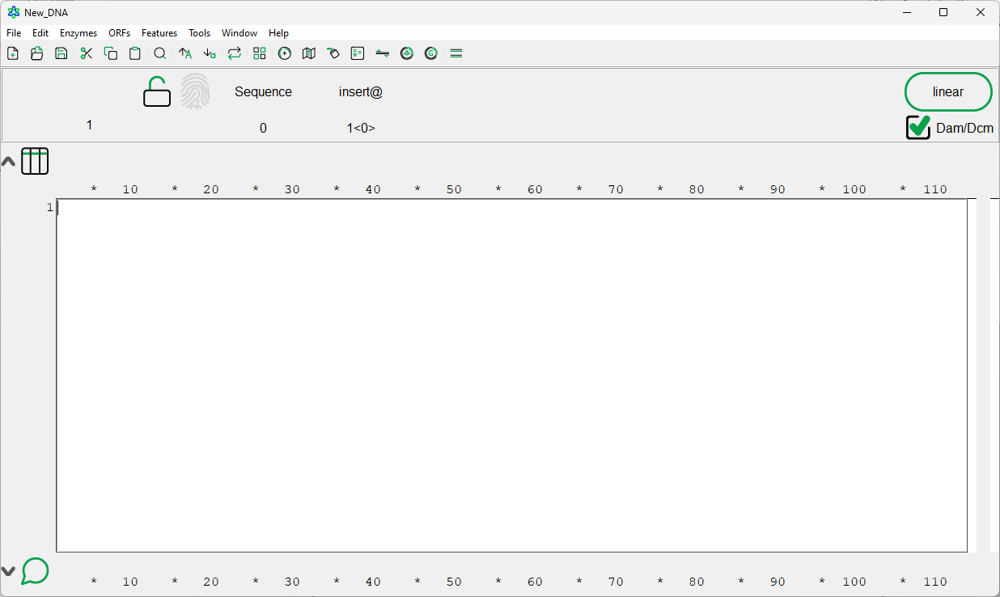
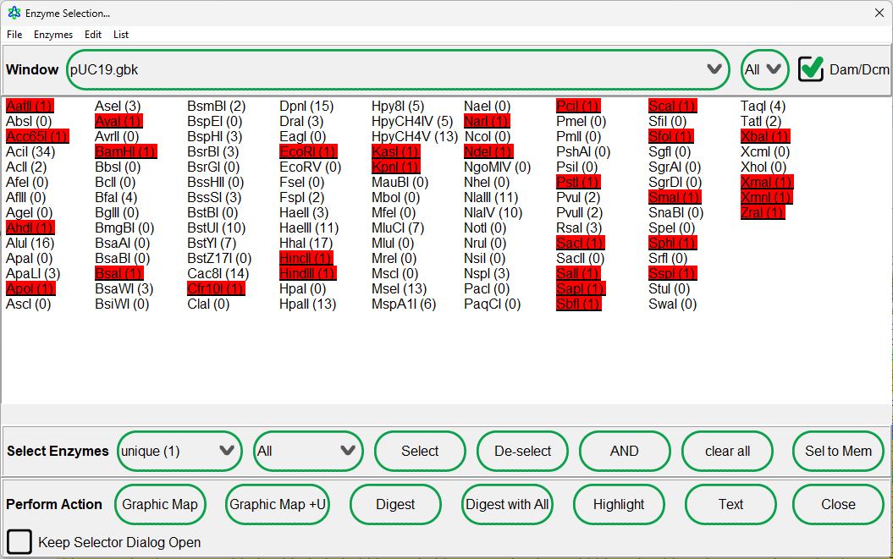
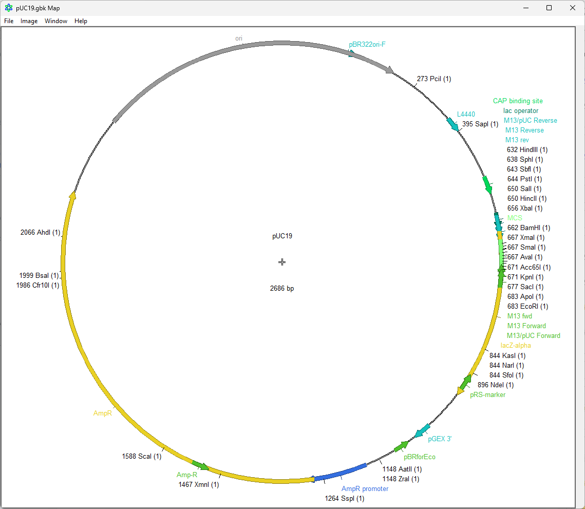
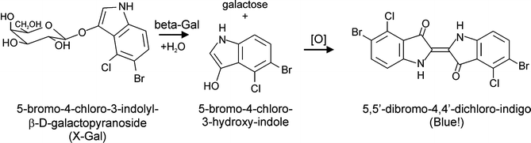
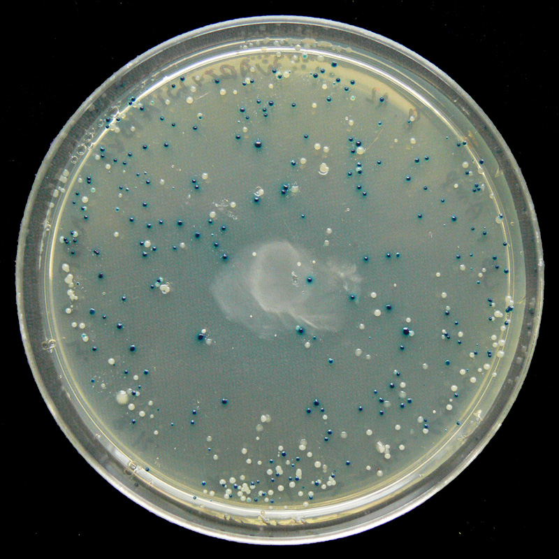

# 3.1: AplasmidEditor (ApE) - Introduction and installation


**Learning Objectives**

* [ ] Describe the function and purpose of AplasmidEditor software.
* [ ] Navigate the AplasmidEditor interface becoming familiar with some basic functions.
* [ ] Briefly explore using AplasmidEditor with plasmids and restriction enzymes.&#x20;


## Background

AplasmidEditor is one of the foundational (and free) tools that we use at the AGC for annotation and visualization of DNA sequences. It provides a user-friendly interface for annotating DNA sequences with features such as genes, promoters, exons, restriction enzyme sites, and many other biologically-relevant highlights. We also use it for visualization of our raw sequencing data. This is probably the first thing that you will have to install and learn how to use (and continue to use). For even the long-term members of the lab, this is still the go-to tool for looking at DNA sequences with annotations.

## Installation


AplasmidEditor (ApE) can be found here: [https://jorgensen.biology.utah.edu/wayned/ape/](https://jorgensen.biology.utah.edu/wayned/ape/)


<figure><figcaption>
<strong>Figure 1.</strong> ApE main webpage.
</figcaption></figure>

After navigating to [the official website](#user-content-fn-1)[^1], download the compressed file that is appropriate for your operating system.

### Windows installation

Unzip the file and you're done! That's it! Sometimes Windows Defender will flag this as a potentially dangerous file because not many people have downloaded it.&#x20;

### OSX 10.11+

Slightly complicated, see Monique for this.

### Linux

If you're using a Linux machine, I'm assuming you know what you're doing. I'll write this later.

## ApE Basic functions

Posted below is a screenshot of the application when you first open it (Figure 1). How exciting! We'll start to go over the more specific features of ApE, but for now we can take a glance at some basic manipulation of sequences.\
\
I'll provide a _brief_ overview below, but you can skip ahead to the applied overview section if you feel comfortable with standard keyboard shortcuts and navigating Windows toolbars.

<figure><figcaption>
<strong>Figure 2.</strong> Screenshot of the main ApE interface.
</figcaption></figure>

### Linear and circular sequences

Starting with the largest and most-obvious button in the corner, clicking the circled `linear` button will make it switch between linear and circular DNA input.


When would DNA be circular instead of linear?


### The graphical toolbar

ApE has a graphical toolbar which has some common tools.

<figure><figcaption>
<strong>Figure 3.</strong> The linear graphical toolbar in ApE's main window. 
</figcaption></figure>

 Standard file management

* **New File** (`CTRL`+`N`)\
  Opens up a new file in a new window. Pretty straightforward.
* **Open File** (`CTRL`+`O`)\
  Open up a file. This could be electropherogram data (`.ab1`), FASTA-formatted files (`.fasta`), GenBank annotated files (`.gb`), or ApE annotated files (`.ape`).
* **Save File** (`CTRL`+`S`)\
  Save the file in the current window.

 The clipboard

* **Cut to Clipboard** (`CTRL`+`X`)\
  Cut the selection from the document and put it into the clipboard.&#x20;
* **Copy to Clipboard** (`CTRL`+`C`)\
  Copy the selection from the document and put it into the clipboard.
* **Paste from Clipboard** (`CTRL`+`V`)\
  Paste from the clipboard directly into the document where your cursor is.

 Find...

**Find** (`CTRL`+`F`)\
Find a short motif in the sequence.

 Changing case

* **Change to Uppercase**\
  Change the selected lowercase sequence to uppercase.
* **Change to Lowercase**\
  Change the selected uppercase sequence to lowercase.

 <strong>Reverse Complement</strong>

Reverse complement the current selection.

**Be careful with reverse complementation!** There are very specific scenarios where you want to reverse-complement just a small portion of your sequence! If you want to reverse-complement your entire sequence, make sure that the entire sequence is selected with `CTRL`+`A`.

 <strong>Enzyme Selection Dialog</strong>

This will open up a window for selecting enzymes for restriction digest. Conveniently, it shows which sites may be present in your sequence. I'll discuss this in more detail in a later chapter ([3.6-ape-extras.md](3.6-ape-extras.md "mention")).

 Cloning and plasmid  tools

* **Graphic Map**\
  A graphical representation of your sequence. This is more fun if you're working with circular DNA like a plasmid.&#x20;
* **Text Map**\
  Creates a text-based map of your sequence with some options to show the complementary strand.
* **Highlight Selected Enzymes**\
  On the current screen, highligh enzymes that were selected in the enzyme selection dialog screen.
* **Digest Dialog**\
  Displays a screen for digesting the DNA sequence in the current screen with restriction enzymes then shows you what the results would look like on a gel.

 PCR Tools

* **PCR**\
  By annotating a set of primers (which we'll do in another chapter), you can actually perform an in-silico PCR! It will give you an expected PCR product, as well as a simulated gel image.
* **Golden Gate Designer**
* **Gibson Designer**

 Align Sequences 

Select sequences for alignment and comparison. [There is a dedicated section for this if you are interested!](3.3-pairwise-alignments.md)

## pUC19: Our practice plasmid

Although the brief documentation above is nice, I am a firm believer in learning by doing it. Follow some of the work below to get some practice working with ApE.\
\
Start off by downloading this annotated file of pUC19 which I've retrieved from [AddGene](https://www.addgene.org/50005/) and altered a little. I've provided it here in GenBank format so that we can take a look at its features.


pUC19 in GenBank format.


pUC19 is a plasmid commonly used as a cloning vector. It was derived from the original pUC plasmid and contains several unique restriction sites which can be used for inserting DNA. Additionally, pUC19 contains a gene that provides ampicillin resistance, making it a useful tool for selecting bacteria that have successfully taken up the plasmid during transformation.


**Some discussion questions**

When you load it up, what kind of things do you notice?\
Is the DNA linear or circular?\
How large (bp) is the plasmid?\
Do you recognize any of the features?


Spoiler screenshot (if you really don't want to open it in ApE yourself)

Like I've stressed, the nice thing with ApE is that it is very easy to navigate through the sequence annotations. I'm sure you can imagine how this would be useful if you wanted to design primers or compare certain regions of interest.


Go into the features and find the AmpR CDS. This is the gene that confers ampicillin resistance for whatever host cell takes up this plasmid. Select all of it and convert it to UPPERCASE so we can see it clearly.


The _lac_ promoter is the binding site for RNA polymerase to transcribe _lacZ (_and what would be the rest of the _lac_ operon). This is its sequence `TTTACACTTTATGCTTCCGGCTCGTATGTTG`.


Uh-oh! I've removed this feature from the plasmid. Find this in the plasmid using `CTRL`+`F`. There should be just one perfect match.


A vector is usually used to be a vehicle for inserting DNA into a host cell as part of cloning or recombination techniques. These insertions are performed by cutting the DNA with specific  restriction endonucleases and ligating the insertion piece in.


**Quick exercise**

Let's prepare for a cloning project!

Open up the [enzyme selection dialog](3.1-aplasmideditor-ape-introduction-and-installation.md#enzyme-selection-dialog) and select all the restriction enzymes that cut just once. It should look something like below:

And click close when you're ready to move on.

Next, click on the [graphic map](3.1-aplasmideditor-ape-introduction-and-installation.md#cloning-and-plasmid-tools) option to view a graphical representation of the plasmid and orient ourselves to where our cut sites are.

Where are these cut sites located? Is there something special about this region?


Some background on LacZ

LacZ codes for the β-galactosidase enzyme. As can usually be [inferred from the name of an enzyme](#user-content-fn-2)[^2], it has something to do with galactose.&#x20;

In our case, it cleaves colourless X-Gal into galactose and another compound that turns blue.

This is sometimes called the blue-white screen because it can be used to screen bacterial colonies for plasmids that have the insert, depending on the colour.


When we have a functioning protein from lacZ and we plate our bacteria with X-gal, what colour might we see?

What about if we performed our insertion? Does the protein still work? What does this mean for the colour?&#x20;


## Summary

AplasmidEditor is a useful tool that provides a user-friendly interface for annotating and visualizing sequences.

[^1]: Just like human genome project was completed in the early 2000s, bioinformatics software pages pay homage by having their websites stuck in that time period.

[^2]: Note: not the ones from Dev Bio. wnt and scribble and frizzle are dumb names.
