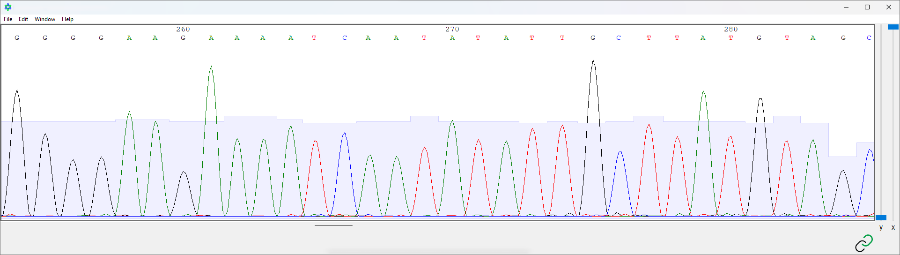
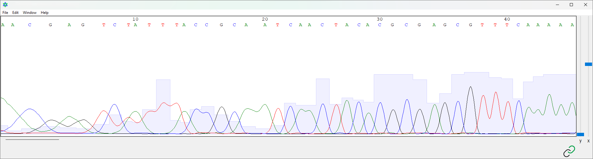
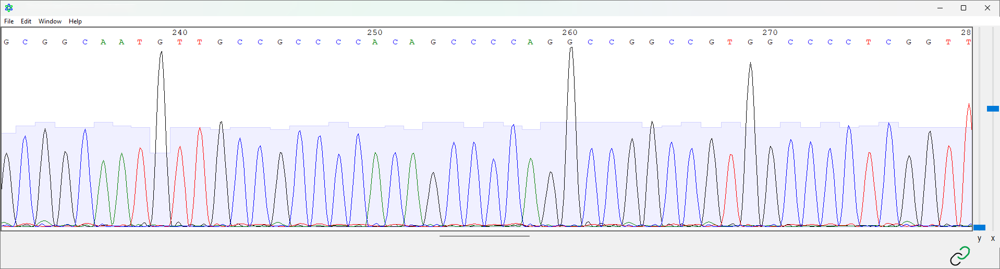
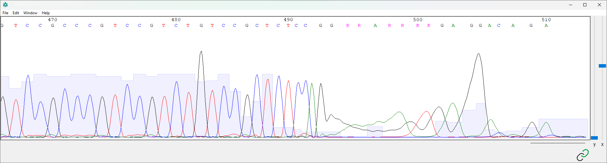
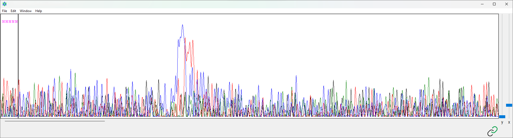
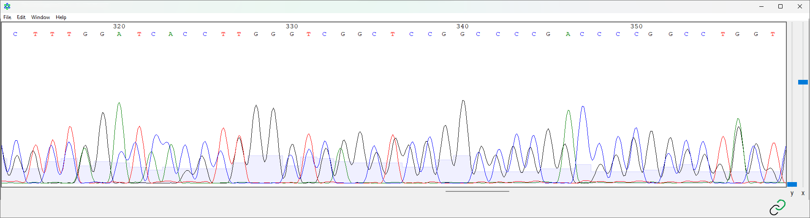
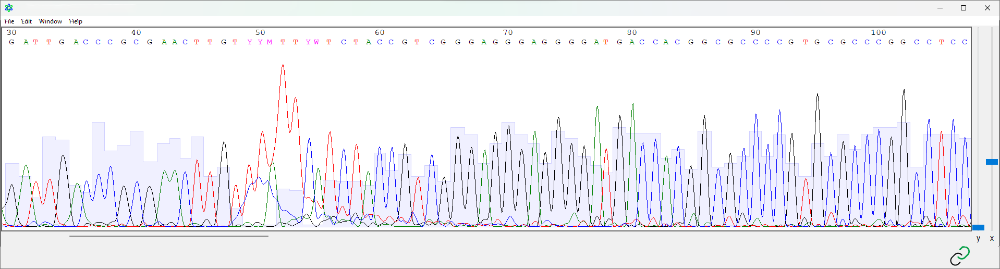
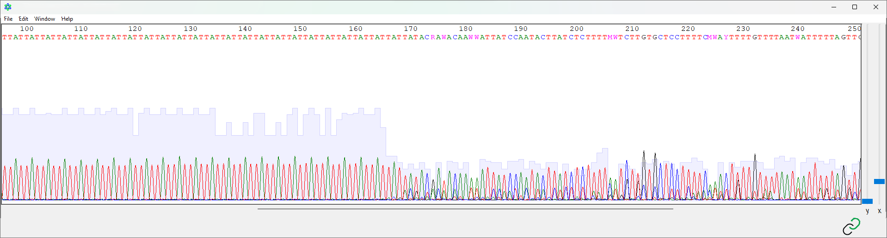

# 3.2: Exploring an electropherogram


**Learning Objectives**

* [ ] Use AplasmidEditor to open and view an electropherogram file.
* [ ] Identify the different components of an electropherogram, including the peaks, baseline, noise, and quality scores.
* [ ] Troubleshoot common issues that may arise when analyzing electropherograms using AplasmidEditor, such as signal saturation or background noise.


## Background

An electropherogram is a graphical representation of the Sanger sequencing output generated by capillary electrophoresis from our SeqStudio. It provides valuable information about the quality of data and the sequence of the amplicon. Analysis of electropherograms involves interpreting the peaks, base calls, and quality scores.

Although a lot of information from the electropherogram can be automatically processed, it's good practice to take a glance at the data to make sure that everything makes sense. It's always important to work through the data and be somewhat skeptical. In some cases, false variants have been reported because nobody took a proper look at the electropherogram!


While processing an electropherogram, it's important to understand the concept of Sanger sequencing (a.k.a. sequencing by termination) and capillary electrophoresis.

[Check out this section if you haven't!](../../appendices/appendix-a-biological-background/review-of-sanger-sequencing.md)


## Opening an electropherogram in ApE

To open an electropherogram in ApE is relatively straightforward. If you've downloaded ApE for the first time, your computer may not recognize that ApE is the program to meant to open `.ab1` files. This is easy enough to fix: just double-click the file and navigate to where you've downloaded ApE.&#x20;

In case you don't have any electropherogram handy, go ahead and download this one.


Electropherogram result from sequencing rbcL in a soybean sample using the forward primer.


## Fluorescent peaks

As explained in the Sanger sequencing review section, peaks are generated as fluorescently-labelled nucleotides pass by a detector. Open up a sequence in ApE and let's take a look at some noticeable patterns.

Navigate to the middle of the sequence and you should see something that looks similar to Figure 1 below.

<figure><figcaption>
<strong>Figure 1.</strong> Screenshot of electropherogram visualization in ApE. 
</figcaption></figure>

Electropherograms are essentially four line graphs overlayed on top of each other.&#x20;

* The x-axis represents detection time and the y-axis represents relative fluorescence.&#x20;
* Each colour represents fluorescence that was detected across a certain wavelength and corresponds to each tagged nucleotide. In ApE, `A`=blue, `T`=red, `C`=blue, `G`=black.
* Peaks should look somewhat parabolic, even in the case of repeated nucleotides. \
  Imagine how the data is created: the fluorescently-labeled nucleotide is excited, the fluorescence is detected, then the excitation diminishes after passing the detector.
* Peaks should be somewhat equally spaced. Note the spacing between the apices and basecalls.

Outside of what we see, take a look at what we don't see as well.

* At each of the coloured peaks, glance down now near the x-axis. There are little blips of other colours detected (background noise), but the distinction between peaks and background noise is completely minimal.
* Also note the lack of non-parabolic peaks — these usually show up in lower quality data, but you'll notice you don't see too much of that here in the middle.

## Phred scores

Phred scores (quality scores/Q scores) are numerical representations of the quality or reliability of basecalls. They provide an estimate of the accuracy at a given position in the DNA sequence. In ApE, these values can be visualized as light-blue bars per peak.

Phred scores are represented as logarithmic values of error probability.

> $$Q = -10 Log_{10} P$$
>
> Where $$Q$$ represents the Phred quality score and $$P$$ represents the base-calling error probability.
>
> Also sometimes represented like this:
>
> $$P=10^\frac{-Q}{10}$$


If a given basecall has an error probability of "1 in 10", what is the Phred score?\
What about 1 in 100? What about 1 in 1000?

Going the other way, what is the error probability if a basecall has a Phred score of `24`?\
What about `37`?


Answers

An error probability of 1 in 10 has a Phred score of `10`.\
An error probability of 1 in 100 has a Phred score of `20`.\
An error probability of 1 in 1000 has a Phred score of `30`.

A phred score of `24` means a basecall has an error probability of `0.00398` or that it is `99.6%` confident.\
A phred score of `37` means a basecall has an error probability of `0.0001995` or that it is `99.98%` confident.


In most statistical significance, `α=0.05`. What Phred score does that correspond to?

We generally set our Phred threshold to `20`. What error probability does that correspond to?


## Sanger sequencing ends

As you may have noticed from the above, I've been focusing mostly on the middle portion of the electropherogram. Generally, this is the highest quality portion of the electropherogram. Through some inherent properties of Sanger sequencing and sequencing-by-termination, the beginning and end of the electropherogram are generally somewhat messier.



<figure><figcaption>
<strong>Figure 2.</strong> Screenshot of the beginning of the electropherogram in ApE.
</figcaption></figure>

Notice that the clean parabolas are not present here at the start of the sequence. The peaks are also not so defined here—notice that many colours and peaks intrude into others. Take a look


Notice the trinucleotide repeat `TTT` at nucleotides `11-13`. Would you be confident in that repeat?

What about the `T` at position `9`? Let's say that the reference sequence goes `5'-GTCATTTACC-3'` but this sequence has that added nucleotide `5'-GTC`**`T`**`ATTTACC-3'`. Would you be confident in that insertion?


Generally, we try to trim off these sequences so that we only report the basecalls that we are confident in.&#x20;



<figure><figcaption>
<strong>Figure 3.</strong> Screenshot of the middle of the electropherogram in ApE.
</figcaption></figure>

We discussed this above, but we can re-iterate some things:

Notice the clean peaks and lack of background noise.

Not bad, if I do say so myself.



<figure><figcaption>
<strong>Figure 4.</strong> Screenshot of the end of the electropherogram in ApE.
</figcaption></figure>

Notice that the clean peaks abruptly stop. If you glance at the Phred-scored bar graph in the background, there's also an immediate drop-off. As the detected fluorescence start to interfere with each other, the machine becomes less confident in making a basecall and instead reports ambiguous nucleotides—the `K` and `R`.


Considering the shape of the peaks and Phred scores, would you be confident in this region of the electropherogram?


We also tend to trim this region off.




Sanger sequencing quality tends to drop off after about 600 nucleotides which is somewhat inherent to the sequencing chemistry. Think about how the addition of a dNTP over a ddNTP to extend the chain is somewhat random.\
\
However, there are situations where we have to sequence larger amplicons of about 1600 bp. What are some strategies for covering the entire amplicon?


## Diagnoses of electropherograms

Of course, we've taken a look at a lot of great electropherogram data, but I wouldn't be writing this workbook if I hadn't also experienced some of the worst results as well.

In this section, we can take a look at diagnosing some bad peak data and understanding why these errors have occurred.

### No usable peaks, NNNN

<figure><figcaption>
<strong>Figure 5.</strong> Screenshot showing a failed run.
</figcaption></figure>

This kind of electropherogram is typical of a failed run where no template or sample was added. With a lack of signal, the SeqStudio will attempt to raise its sensitivity to detect fluorescence. In doing this, while there appears to be peak information, the SeqStudio is just detecting background noise. There is no usable data here and the run must be repeated.

### Messy double peaks, low quality

<figure><figcaption>
<strong>Figure 5.</strong> Screenshot showing many double-peaks, not indicative of heterozygosity.
</figcaption></figure>

This electropherogram shows that for every basecall position, there is a competing second peak that is clearly not part of the background noise. With these kinds of results, it suggests that there is another amplicon being sequenced at the same time as the intended amplicon. This usually arises from contamination. Saving this kind of data is extremely difficult and usually, I would suggest that this run be repeated.

### Blob of low-quality

<figure><figcaption>
<strong>Figure 6.</strong> Screenshot showing generally good-quality peaks with a random portion of lower quality.
</figcaption></figure>

Sometimes, an electropherogram will appear to be generally good-quality, except in random blobbed portions where the quality scores drop substantially and pick up again. This is indicative of improper cleanup. This is what appears when there are slight traces of XTerminator solution in your sequencing sample. Again, this data cannot be rescued.

### Slippage

<figure><figcaption>
<strong>Figure 7.</strong> Screenshot showing generally good-quality peaks with an immediate drop in quality.
</figcaption></figure>

When sequencing regions with repeats, unfortunately Sanger sequencing experiences the same issue that causes those repeats in the first place—DNA polymerase slippage. You can try combinations of buffers to try to increase this fidelity, but generally, I would not recommend sequencing repeat regions in the first place. Consider fragment-length analysis (FLA) if you are determined to genotype that region.


If you're feeling confident about some of these, try diagnosing some of the problems in the electropherogram files below!



Electropherogram result from sequencing a bovine gene.



Electropherogram result from sequencing rbcL in a soybean.



Electropherogram result from sequencing a bovine gene.


## Summary

Electropherograms provide important information about the quality of the data that comes off the SeqStudio. The quality score information and peak shape provide context towards the confidence in basecalls.
