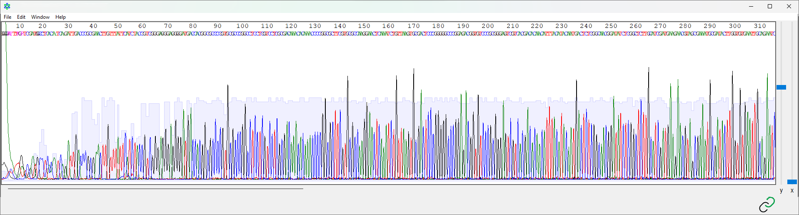
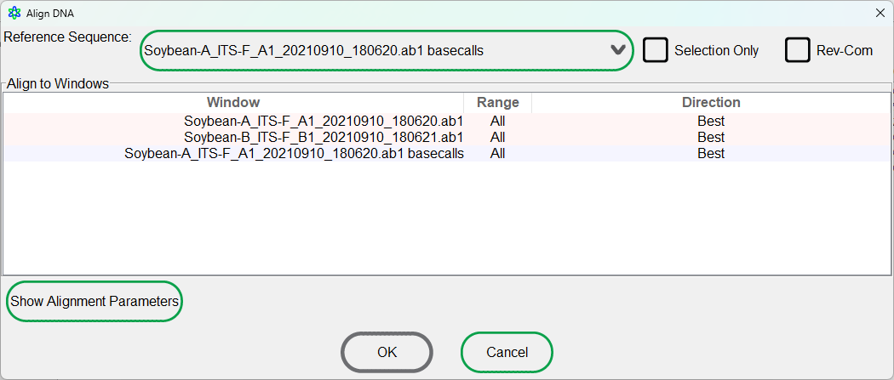
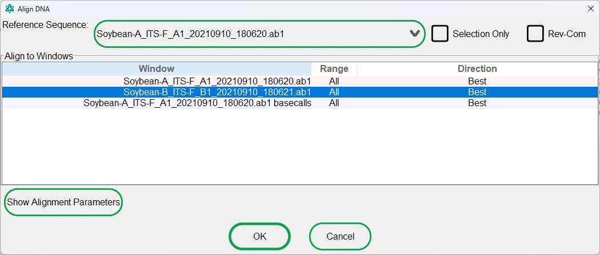
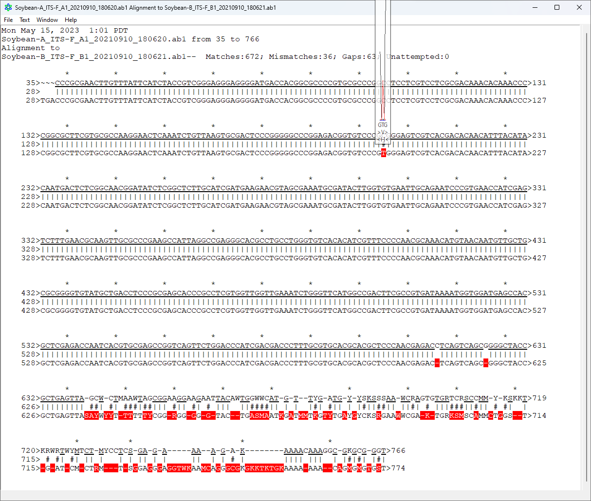

# 3.3: Pairwise alignments


**Learning Objectives**

* [ ] Use AplasmidEditor to perform pairwise sequence alignment of two DNA sequences.
* [ ] Interpret the alignment results to identify similarities and differences between the two sequences.
* [ ] Analyze the alignment output to identify potential mutations, insertions, and deletions in the sequences.
* [ ] Use AplasmidEditor to verify heterozygous SNPs, false SNPs, and other artifacts of Sanger sequencing.


## Background

Pairwise alignment is a fundamental technique in bioinformatics that is used to compare and analyze the similarity between sequences (whether it be DNA, RNA, or even amino acids). The process involves aligning the characters to maximize their similarities.

Alignments can be used to identify homologous sequences, discover conserved regions, and detect functional motifs. By aligning sequences, researchers can infer evolutionary relationships, identify mutations, and predict protein structures and functions. Pairwise alignments also play a vital role in sequence database searches, multiple sequence alignments, and phylogenetic analyses.

I will write a more detailed section on this that I will put into the Biological Background section, but there is some of it in the [BLAST module here](../2-the-ncbi-toolset/2.2-blast.md#the-algorithm).

## Pairwise alignment in ApE

Performing alignments in Ape is fairly intuitive. Download the files below to get started with this.


Electropherogram result from sequencing rbcL in soybean A.



Electropherogram result from sequencing rbcL in soybean B.


### 1. Opening and inspecting the files

Taking a look at the electropherogram, you may notice how similar they seem. They should be! I sequenced the same portion of the same housekeeping gene. If they were wildly different, this would be a bit of a problem. That said, there is approximately 600 bp of usable sequence for each of those files.



<figure><figcaption>
<strong>Figure 1.</strong> Screenshot from ApE showing the electropherogram result for Soybean-A.
</figcaption></figure>



<figure><figcaption>
<strong>Figure 2.</strong> Screenshot from ApE showing the electropherogram result for Soybean-B.
</figcaption></figure>




Can you imagine manually going through nucleotide by nucleotide to compare these two?

Because that's what people used to have to do!


### 2. Performing the pairwise alignment

To perform a pairwise alignment, go to the main ApE window that looks like Figure 3 below. The option for performing an alignment is only available from this screen. If you have only opened those two electropherogram files, then this window may not be open. You can open this by selecting `File` > `New DNA from basecalls` or by using `Ctrl+Shift+N`.

<figure><figcaption>
<strong>Figure 3.</strong> Main ApE window with options for performing pairwise alignments in the main toolbar.
</figcaption></figure>

To the far right of the graphical toolbar is the option for performing alignments and leads to the following window.

<figure><figcaption>
<strong>Figure 4.</strong> ApE window with options for performing alignments with the opened windows.
</figcaption></figure>

To perform a pairwise alignment, first you need to select a reference sequence (which is somewhat arbitrary here for our case here). Between `Soybean-A` and `Soybean-B`, select one of those to be the reference sequence, then in the `Align to Windows` section, select the other Soybean sample to be the query sequence.

If you used the `New DNA from basecalls` command, you may have a window titled {SAMPLE} basecalls. For our case in this "tutorial", use the file that isn't basecalls, i.e., the `.ab1` file.

<figure><figcaption>
<strong>Figure 5.</strong>  ApE window with options selected for performing a pairwise alignment.
</figcaption></figure>

Click `OK` to perform the alignment.

### 3. Analysis of pairwise alignment results

ApE will open up a window showing a pairwise alignment (Figure 6). Above the underline is the reference sequence (which for me was Soybean-A), and below it are the query sequences (which for me is just Soybean-B).

<figure><figcaption>
<strong>Figure 6.</strong>  Pairwise alignment screen from ApE showing alignment between Soybean-A (above) and Soybean-B (below)
</figcaption></figure>

Using a monospaced typeface, each of the nucleotides should line up to something else, whether it be a `gap`, `matched nucleotide`, or `mismatched nucleotide`. Between nucleotides, matches are indicated with `|`, mismatches are indicated with `#`, and   (a space) is shown between aligned gaps. For visualization, mismatches are also shown in red.


Can you find any matches or mismatches?


A feature of ApE is to show a small trace file window as you mouse over each nucleotide. When you double-click those regions, it will also highlight and open the respective trace file at that position.&#x20;


Take a look at the C>T mismatch near the middle of the clean sequence.\
Open it in both trace files. Would you be confident in this alignment?

Now take a look at any of the mismatches near the end of the alignment.\
Would you be confidence in these mismatches?



Consider the content from this last section ([3.2-exploring-an-electropherogram.md](3.2-exploring-an-electropherogram.md "mention")). Does this make sense with the idea of trimming?


## Summary

Pairwise alignment is a fundamental technique in bioinformatics that can be used to identify homologous sequences, discover conserved regions, and detect functional motifs.

As something we do in our lab, it is important to verify alignments against the electropherogram.
